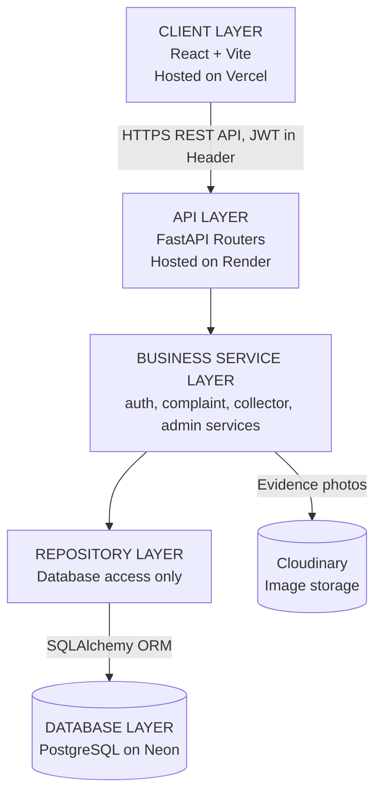

# NammaVoice AI

**Every Citizen's Voice Matters.**

## Live Demo
- Frontend: https://namma-voice-67ijc245r-optimiser.vercel.app
- Backend health check: https://nammavoice-ai.onrender.com/health
- API docs (Swagger): https://nammavoice-ai.onrender.com/docs

## Overview
NammaVoice AI is a civic governance platform where citizens report public infrastructure issues (potholes, garbage overflow, water leaks, broken streetlights) instead of scattering complaints across WhatsApp, calls, and social media. A citizen submits a complaint with a photo, category, and location; it becomes visible to officers in the relevant department, who accept and resolve it; the citizen then confirms whether the fix genuinely worked before it's closed. Collectors and Admins get district-wide and system-wide visibility respectively.

## Architecture Diagram



Full ER Diagram and Class Diagram: [`/docs/diagrams`](./docs/diagrams)

## Tech Stack

| Layer | Technology |
|---|---|
| Frontend | React (Vite), Axios, React Router — hosted on Vercel |
| Backend | FastAPI — hosted on Render |
| ORM | SQLAlchemy |
| Database | PostgreSQL (Neon, cloud-hosted) |
| Migrations | Alembic |
| Auth | JWT (PyJWT) + bcrypt password hashing |
| Image Storage | Cloudinary |
| Testing | pytest, pytest-mock, pytest-cov |
| CI/CD | GitHub Actions |
| API Docs | FastAPI auto-generated Swagger (`/docs`) |

## Features

**Auth**
- Signup and login for 4 roles: Citizen, Officer, Collector, Admin
- JWT-based sessions, role-aware routing to each dashboard

**Citizen Module**
- Submit a complaint with title, description, category, district, department, and an optional photo
- View own complaints with live status
- Confirm or reject a resolution once an officer marks it completed

**Officer Module**
- View unassigned complaints within their department
- Accept a complaint (assigns it to themselves)
- Update complaint status
- Every status change is logged to a status-history table

**Collector Module**
- District-wide dashboard: total, pending, and completed complaint counts
- Full list of complaints within their district

**Admin Module**
- List all registered users across the system (role-restricted endpoint)

**Reference Data**
- Endpoints to seed District, Department, and Category records used across complaint submission and dashboards

## Getting Started

### Prerequisites
- Python 3.10+
- Node.js 18+
- A free [Neon](https://neon.tech) PostgreSQL database
- A free [Cloudinary](https://cloudinary.com) account

### Backend Setup
```
cd backend
python -m venv venv
venv\Scripts\activate
pip install -r requirements.txt
```
Copy `.env.example` to `.env` and fill in your own values.

Run migrations:
```
alembic upgrade head
```
Start the server:
```
uvicorn app.main:app --reload
```
Runs at `http://127.0.0.1:8000` — Swagger docs at `http://127.0.0.1:8000/docs`.

### Frontend Setup
```
cd frontend
npm install
npm run dev
```
Runs at `http://localhost:5173`.

## Environment Variables

**Backend**

| Name | Description | Required |
|---|---|---|
| `DATABASE_URL` | Neon PostgreSQL connection string | Yes |
| `SECRET_KEY` | Secret used to sign JWT tokens | Yes |
| `CLOUDINARY_CLOUD_NAME` | Cloudinary account cloud name | Yes |
| `CLOUDINARY_API_KEY` | Cloudinary API key | Yes |
| `CLOUDINARY_API_SECRET` | Cloudinary API secret | Yes |

**Frontend**

| Name | Description | Required |
|---|---|---|
| `VITE_API_URL` | Base URL of the deployed backend | Yes (production only; defaults to localhost) |

## API Documentation
Live Swagger UI: https://nammavoice-ai.onrender.com/docs

## Running Tests
```
cd backend
pytest --cov=app.services --cov-report=term-missing
```
Unit tests cover the service layer (auth, complaint, collector, admin) using mocked repositories — no real database needed to run them.

## Deployment
- **Backend**: Render (free tier), auto-deploys on push to `main`
- **Frontend**: Vercel (free tier), auto-deploys on push to `main`
- **Database**: Neon (managed PostgreSQL, free tier)
- **Image storage**: Cloudinary (free tier)
- **CI**: GitHub Actions runs the full test suite on every push and pull request to `main` — see `.github/workflows/backend.yml`

## Folder Structure
```
NammaVoice-AI/
├── .github/workflows/      # CI pipeline
├── backend/
│   └── app/
│       ├── api/            # routers: auth, complaints, officer, collector, admin, reference
│       ├── core/           # settings, database connection, security, cloud storage
│       ├── models/         # SQLAlchemy models (7 entities)
│       ├── schemas/        # Pydantic request/response schemas
│       ├── services/       # business logic
│       └── repositories/   # database access layer
│   ├── alembic/            # database migrations
│   └── tests/               # pytest unit tests
├── frontend/
│   └── src/
│       ├── api/
│       └── pages/          # Login, Signup, Citizen/Officer/Collector/Admin dashboards
├── docs/diagrams/           # architecture, ER, and class diagrams
├── problem-statement.md
├── CHANGELOG.md
└── README.md
```

## Future Enhancements
- AI-based image classification for automatic issue categorization
- Duplicate complaint detection
- GPS location capture on complaint submission
- Google/phone-based sign-in
- Structured logging and monitoring dashboard